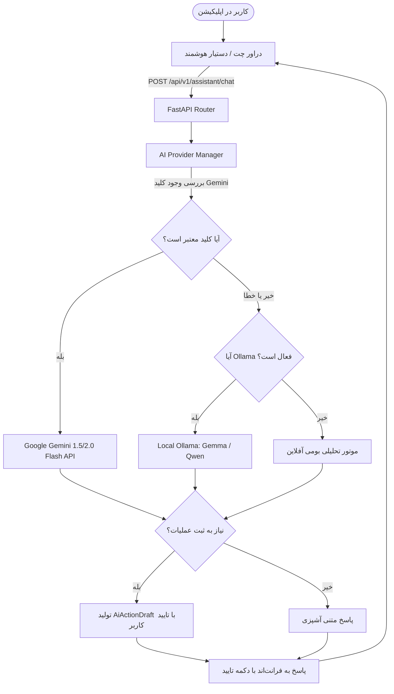

# اتصال هوش مصنوعی Google Gemini به دستیار آشپزخانه هوشمند

این سند طرح فنی نحوه پیاده‌سازی و اتصال API مدل‌های **Google Gemini** (نظیر `gemini-1.5-flash` و `gemini-2.0-flash`) به سیستم بک‌اند و فرانت‌اند دستیار آشپزخانه را مشخص می‌کند.

---

## 🎯 اهداف پیاده‌سازی
1. **پشتیبانی مستقیم از Gemini API**: ایجاد ماژول اختصاصی `GeminiAdapter` با سرعت بالا و به‌صورت Asynchronous با استفاده از `httpx` (بدون نیاز به کتابخانه‌های سنگین خارجی).
2. **سوییچینگ هوشمند و پایدار (Auto-Failover)**:
   - اولویت ۱: Google Gemini (در صورت وجود کلید معتبر `GEMINI_API_KEY`)
   - اولویت ۲: مدل‌های محلی Ollama (`gemma3:1b` / `qwen3-coder:30b`)
   - اولویت ۳: موتور تحلیل فوری آفلاین (Rule-based Heuristic)
3. **شناسایی ساختاریافته اقدامات (Action Drafts)**: قدرت‌گیری هوش مصنوعی در درک دستورات کاربر به زبان فارسی (مثلاً «دو کیلو سبزی به یخچال اضافه کن» یا «ناهار فردا رو خورش کرفس بذار») و تولید پیش‌نویس امن برای تایید کاربر.
4. **تنظیم و تست کلید API در پنل کاربری**: افزودن اندپوینت‌های بررسی سلامت و تست کلید API در بک‌اند و ویجت وضعیت و ورود کلید در فرانت‌اند.

---

## تغییرات پیشنهادی در سیستم

### ۱. لایه تنظیمات و متغیرهای محیطی (`apps/api/app/core/config.py`)
- افزودن متغیرهای:
  - `gemini_api_key`: کلید دریافت شده از Google AI Studio (از طریق `os.getenv("GEMINI_API_KEY")` یا تنظیمات ذخیره‌شده).
  - `gemini_model`: مدل پیش‌فرض (پیش‌فرض: `gemini-1.5-flash` یا `gemini-2.0-flash`).
  - `ai_provider`: اولویت ارائه‌دهنده (`auto`, `gemini`, `ollama`).

### ۲. آداپتور Gemini (`apps/api/app/ai/gemini_adapter.py`) [NEW]
- پیاده‌سازی کلاینت غیرهمگام بر بستر Google Generative Language REST API (`v1beta`).
- پرامپت مهندسی‌شده فارسی برای فرهنگ غذایی اصیل ایرانی، رعایت دقیق آلرژی‌ها و رژیم سلامت خانوار.
- استخراج ساختاریافته JSON برای سناریوهای عملیاتی (`add_pantry`, `plan_meal`, `add_shopping`).
- متد اعتبارسنجی اتصال (`validate_key()`).

### ۳. مدیریت واحد هوش مصنوعی (`apps/api/app/ai/manager.py`) [NEW]
- ایجاد واسط یکپارچه `AIManager` که وظیفه انتخاب بهترین مدل فعال (Gemini یا Ollama)، مدیریت خطاها، مدیریت توکن و برگرداندن پاسخ همراه با پیش‌نویس را بر عهده دارد.

### ۴. مسیرهای API بک‌اند (`apps/api/app/api/v1/routes.py`)
- بروزرسانی اندپوینت `/api/v1/health` برای گزارش وضعیت هر دو موتور Gemini و Ollama.
- افزودن اندپوینت `GET /api/v1/ai/status` برای نمایش موتور فعال، مدل جاری و وضعیت اتصال.
- افزودن اندپوینت `POST /api/v1/ai/config` برای تنظیم موقت یا تست اتصال کلید API بدون نیاز به ری‌استارت سرور.
- اتصال `/api/v1/assistant/chat` به `ai_manager`.

### ۵. رابط کاربری فرانت‌اند (`apps/web`)
- دراور هوش مصنوعی (AI Drawer): افزودن بج وضعیت اتصال هوش مصنوعی (`✨ Gemini 1.5 Flash` با افکت بنفش/سبز گرادیان).
- مودال یا بخش تنظیمات کلید: امکان وارد کردن `GEMINI_API_KEY` شخصی یا مشاهده وضعیت سرور همراه با دکمه «بررسی اتصال».
- نمایش مدل پاسخ‌دهنده در زیر پیام‌های چت دستیار.

---

## نمونه معماری جریان داده

---

## برنامه راستی‌آزمایی (Verification Plan)

### تست‌های خودکار و بک‌اند:
1. اجرای اسکریپت تست برای سنجش سلامت پکیج و کلاینت Gemini با کلید تست یا پیام‌های ساختگی.
2. اعتبارسنجی اندپوینت `/api/v1/health` و `/api/v1/ai/status` با `curl`.
3. تست ارسال پیام به `/api/v1/assistant/chat` و اطمینان از عملکرد صحیح در هر دو حالت (با کلید و بدون کلید).

### تست رابط کاربری:
1. باز کردن دراور هوش مصنوعی در مرورگر و اطمینان از نمایش بج ارائه‌دهنده فعال.
2. تست پاسخ صوتی یا متنی چت در مرورگر.
